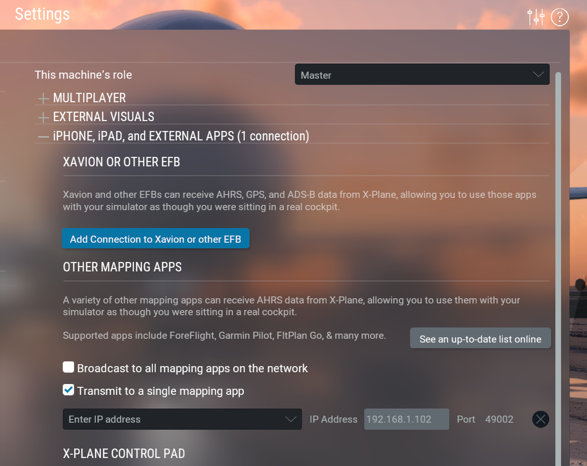

# X-Plane 12 AHRS to NMEA
X-Plane 12 AHRS (Attitude and heading reference system) to NMEA converter 
Since X-Plane 12 for mac/linux does not offer direct NMEA output to serial/socket.   

This script reads AHRS messages, translate to NMEA output and writes to a destination (can be TCP / UDP socket or serial interface)


Tested with X-Plane 12 on Mac m1 with naviter-condor-dongle (CP210x USB to UART Bridge) and SeeYou Navigator v2.6.x

### Setup

```shell
python3 -m venv  .venv
source .venv/bin/activate
pip install -r requirements.txt
```

edit ahrs_nmea.py to match your destination

Start X-Plane in Settings -> Network -> Enable transmit to a single mapping app with your ip/port


Start converter script:

```shell
python3 ahrs_nmea.py
```


#### Resources 

* X-Plane: https://www.x-plane.com/
* SeeYou Navigator: https://naviter.com/seeyou-navigator/
* naviter-condor-dongle https://kb.naviter.com/en/kb/naviter-condor-dongle/
* https://campar.in.tum.de/twiki/pub/Chair/NaviGpsDemon/nmea.html#GSA
* https://www.manualslib.de/manual/5255/Lxnav-Lx8000.html?page=78
* https://github.com/musurca/msfs2fltplan/blob/master/connect.py

